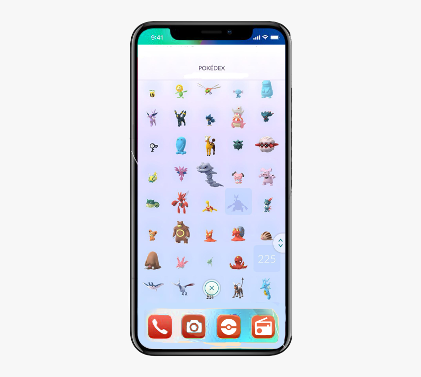

# Projet REACT JS POKEDEX 

## Membres

	Manuel DASSI KUETI

## Fonctionnalités rendus

#### ! Back-end :

	-Gestion des pokemons
	-Gestion des essais et tests

#### !Front-end :
	- Lien redirigeant vers Le Pokedex
	- Interface listes de Pokemon
	- Interface Crud - BOOSTRAP CMS INTEGRÉE

## DIFFILCULTES RENCONTREES

    Le langage REACT JS
    LE TYPE SCRIPT
    npm car j'ai perdu enormément de temps sur la documentation v18.1 de react pourtant je n'avais pas la bonne

## Bonus 

## Requirements

- [x] Mongo execute Prompt / Bash
- [x] Node Module 
- [x] React JS
- [x] mongod --port 27017 --dbpath /path

## Installation

    
    git clone https://github.com/dassimanuel000/pokedex.git
    cd pokedex
    npm install
    npm start ||  nodemon index
    

## Good practice

* Please create your `*.env` and source files in an appropriate directory
(it may already exist)
* Always make your path is relative to root directory and thus run `landslide`
from it
* If applicable, update `index.js` with the link to you new slides

!!  Next, just run:

	  localhost:3000
    
       
## Publishing

Presentation are served under 
    npm build 

## Structure

    ├── node   Module   --> symbolic link to module
    ├── src             --> root
    │   ├── components  --> Widget Folder directory
    │   ├── App         --> Edit React application
    │   ├── Index       --> Init React application
    │   ├── data        --> React application
    │   │   └── js      --> Json Pokedex
    ├── publics         --> Github  readmme
    │   ├── img         --> Assets  for readmme
    │   ├── assets      --> Assets
    │   ├── index       --> home page, not generated
    │   └── *.html      --> presentation files
    └── *               --> any other directory containing *.env files

## 🛠️ Our favorite tools

### 👨‍💻 Programming languages

    
    
### 🧰 Frameworks and libraries

	 
    

### 🗄️ Databases and cloud hosting

    
    

 

## Notes

https://www.estiam.education/charte-graphique/
